# ReviewKit

ReviewKit reviews **one DOCX**. That walk is the review. It opens the file
and stays on it: it does not review an abstract copy and write a different
file only at the end. A side effect on that same file may add a comment,
update a comment, delete a comment, or change the text as a Word tracked
change. Many comments can sit on one sentence because a later stay adds
another while earlier ones stay.

Docxtor is Word. ReviewKit only supplies the rhythm. If the decision is to
change a sentence, it is a tracked replace. If the decision is to delete, it
is a tracked deletion. If the decision is to add a sentence inside an
akapit, it is a tracked insertion. Comments stay Word comments.

## The walk

Order, always:

1. **zdanie** — each sentence. On a sentence, stay (iterate this same
   sentence again) or go (the next sentence).
2. **akapit** — after every sentence is done, the same stay-or-go loop over
   each paragraph.
3. **rozdział** — then the same loop over each chapter (a section cut of
   the document).
4. **całość** — then the whole document, walked *n* times, with the same
   stay-or-go loop on each walk.

```mermaid
flowchart TD
  start["one DOCX"] --> z1["zdanie 1"]

  z1 --> z1q{"stay or go?"}
  z1q -->|stay: comment or text on this DOCX| z1
  z1q -->|go| z2["zdanie 2"]

  z2 --> z2q{"stay or go?"}
  z2q -->|stay: comment or text on this DOCX| z2
  z2q -->|go| zMore["zdanie …"]

  zMore --> zMoreq{"stay or go?"}
  zMoreq -->|stay: comment or text on this DOCX| zMore
  zMoreq -->|go: every zdanie done| a1["akapit 1"]

  a1 --> a1q{"stay or go?"}
  a1q -->|stay: comment or text on this DOCX| a1
  a1q -->|go| a2["akapit 2"]

  a2 --> a2q{"stay or go?"}
  a2q -->|stay: comment or text on this DOCX| a2
  a2q -->|go| aMore["akapit …"]

  aMore --> aMoreq{"stay or go?"}
  aMoreq -->|stay: comment or text on this DOCX| aMore
  aMoreq -->|go: every akapit done| r1["rozdział 1"]

  r1 --> r1q{"stay or go?"}
  r1q -->|stay: comment or text on this DOCX| r1
  r1q -->|go| r2["rozdział 2"]

  r2 --> r2q{"stay or go?"}
  r2q -->|stay: comment or text on this DOCX| r2
  r2q -->|go| rMore["rozdział …"]

  rMore --> rMoreq{"stay or go?"}
  rMoreq -->|stay: comment or text on this DOCX| rMore
  rMoreq -->|go: every rozdział done| c["całość"]

  c --> cq{"stay or go?"}
  cq -->|stay: walk całość again, n times| c
  cq -->|go: done, same DOCX| done["same DOCX"]
```



```python
from reviewkit import (
    AKAPIT,
    CALOSC,
    ROZDZIAL,
    StayOrGo,
    ZDANIE,
    review_docx,
)

result = review_docx(path, reviewer)
# reviewer.decide(unit, docx) -> StayOrGo.STAY or StayOrGo.GO
# unit.level is zdanie, akapit, rozdział, or całość
# docx.add_comment / update_comment / delete_comment write Word comments
# docx.replace_text / delete_text / insert_text write tracked changes
```

Stay count on one unit is however many times the reviewer stays. Go at the
end leaves that same file.

## Install and run

```bash
uv sync
uv run reviewkit input.docx --reviewer my_reviewers:make_reviewer
```

Requires Python >= 3.13. Physical DOCX work is Docxtor.

## Contributors

- [mikolaj92](https://github.com/mikolaj92)
- [PSyron](https://github.com/PSyron)

## License

ReviewKit is released under the MIT License. See [LICENSE](LICENSE).
